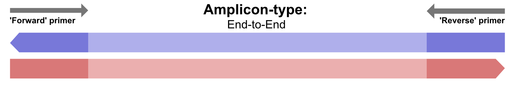
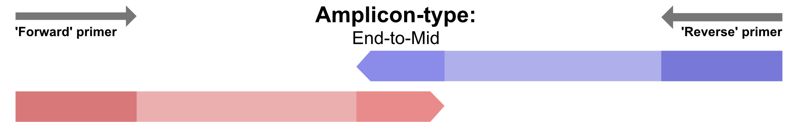
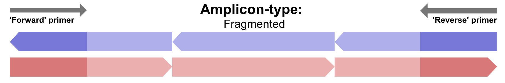

# Amplicon Types

AmpliGone requires user information when it comes to the 'amplicon type'. This describes the length of a PCR amplicon, and which part of said amplicon is actually sequenced. This information is required because it tells AmpliGone from which side(s) of a read the primer-sequence has to be removed.

The given options are ["End-to-End"](#end-to-end), ["End-to-Mid"](#end-to-mid), and ["Fragmented"](#fragmented).

## End-to-End

An "End-to-End" amplicon type describes the situation where a read covers the full length of an amplicon. This is most prominent in, but not exclusive to, long read sequencing platforms such as Nanopore.  
In this case of an "End-to-End" amplicon type, primers need to be removed from both ends of a read.

When given the "End-to-End" amplicon type, AmpliGone follows the logic that both forward and reverse reads should start at a forward-primer and stop at a reverse-primer. The orientation of the reads doesn't matter in this case.

## End-to-Mid

An "End-to-Mid" amplicon type describes the situation where a reads cover the amplicon only partially, and partially overlap in the amplicon mid-point. This is most prominent in, but not exclusive to, short read Illumina sequencing.  
In this case of an "End-to-Mid" amplicon type, primers need to be removed from only one end of a read.

When given the "End-to-Mid" amplicon type, AmpliGone follows the logic that a forward-read may only start at a forward-primer. And a reverse-read may only start at at a reverse-primer.

## Fragmented

A "Fragmented" amplicon type describes the situation where multiple smaller reads cover one larger amplicon. This is prominent, but not exclusive to, short read Illumina sequencing of larger amplicons.  
In this case of a "Fragmented" amplicon type, primers need to be removed from reads that can be linked <u>directly</u> to a primer region.  

When given the "Fragmented" amplicon type, AmpliGone follows the logic that both forward and reverse reads can contain a primer sequence. But reads don't necessarily *have* to start at a primer location.  
A "fragment lookaround size" is used to determine whether or not a read is related to a primer location, the default value for this is 10bp, meaning that AmpliGone will assume a read is related to a primer position if it starts or ends within 10bp of the primer position.  This value can be changed with the `--fragment-lookaround-size` flag.

## Why is a more common terminology not used?

Because we quickly found out that more common terminology such as paired-end/single-end, or short/long read, doesn't *always* convey the information that AmpliGone needs in a single keyword or argument. And information such as a sequencing platform doesn't always convey this information either.

As an example: it's most common that primers are only present on one side of a read if the sequencing was performed with "short reads" on an Illumina platform. ***But that's not necessarily always the case***, because depending on the actual experiment setup the primers might actually be on both ends of those short reads.

With AmpliGone we wanted a way to actually get the information that is required and matches with an experiment design, without the user having to give multiple pieces of information through various command-line arguments.