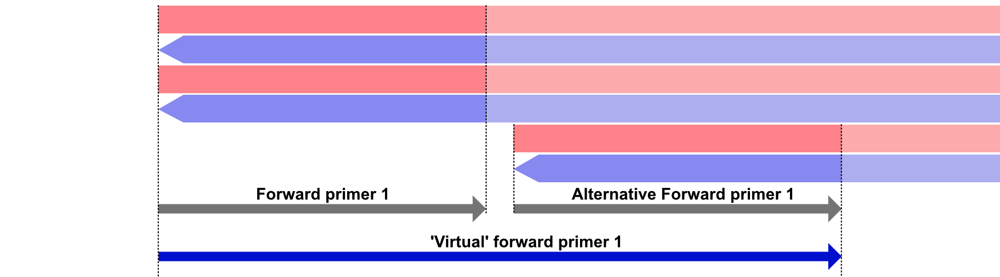

# User Guide

AmpliGone works with both reads in FASTQ format, as well as aligned data in BAM-format. However, when data is presented in the BAM-format then only read-data (sequence and quality scores) will be used. Other data present in the BAM-format will not be used in this version of AmpliGone.

Currently, AmpliGone supports Nanopore data and Illumina data. The Illumina platform (NextSeq/MiSeq/HiSeq/other) does not matter.

It is however important that you know the read-length in relation to the amplicon length.
AmpliGone expects this information in the form of an 'amplicon-type'.
Please see [this page](amplicon-types.md) for more information regarding supported amplicon-types.

## Preparing input data

For optimal results we ask you to format your inputs to make sure you get the best results in your analysis.

It is required that adapters/barcodes have been removed from your sequencing reads *before* they are processed by AmpliGone.
Processing read-data with adapters/barcodes still attached to your reads may result in inaccurate output data.

Additionally, AmpliGone works best with reads that have already been processed by quality filtering tools such as [fastp](https://github.com/OpenGene/fastp) or [Trimmomatic](https://github.com/usadellab/Trimmomatic).


### Primers

AmpliGone has two options for primer input: [BED](https://en.wikipedia.org/wiki/BED_(file_format)) and [fasta](https://en.wikipedia.org/wiki/FASTA_format).
The BED format specifies the coordinates of the primers with respect to the given reference genome. If this is the format you use, you can skip to [Primer Orientation](#primer-orientation)

When the primers are supplied in fasta format, AmpliGone searches for the primer coordinates based on the given reference.
By default, mismatches are tolerated for up to 10% (0.1) of the length of the primer sequence.
It's therefore important that the given primers adequately match the given reference, otherwise the primer-coordinates cannot be determined.

If necessary, you can adjust the maximum amount of differences (substitutions) which are tolerated to be either more lenient or stringent. You can do so by giving the `--error-rate`/ `-er` flag in your command, followed by a decimal number. For example `--error-rate 0.15` can be used to make the search more lenient.  
Please see the [usage examples](#basic-usage-examples) to see this flag in combination with other settings for AmpliGone.

### Primer Orientation
AmpliGone determines whether a given sequence is considered to be a 'forward primer' or a 'reverse primer'. This information is taken from the name of a primer sequence in the FASTA header with specific keywords, the usable keywords are as follows:

=== "Usable keywords"
    | Forward primers | Reverse primers |
    | --------------- | --------------- |
    | LEFT            | RIGHT           | 
    | PLUS            | MINUS           |
    | POSITIVE        | NEGATIVE        |
    | FORWARD         | REVERSE         | 

=== "Example fasta" 
    ```
    >primer_1_LEFT
    ACTGGC
    >primer_1_RIGHT
    TGGCTCA
    >primer_2_FORWARD
    ACAATTCG
    >primer_2_REVERSE
    TATTAAGC
    ```

The primer sequences may contain IUPAC ambiguity nucleotides, though be aware that this may result in differently found coordinates as expected depending on your experiments.

### Virtual Primer Mode

Virtual primer mode is a feature in AmpliGone that enhances the the removal of closely positioned primers that share the same orientation. When enabled with the `--virtual-primers` or `-vp` flag, AmpliGone will combine these nearby primers into a single "virtual" primer. This ensures comprehensive removal of all primer-related data in regions where multiple primers may overlap or exist in close proximity.



You should enable virtual primer mode when working with amplicons that utilize multiple alternative primers targeting the same region for increased specificity. This commonly occurs in primer designs where several primer variations are employed to improve target capture across diverse samples or to account for potential sequence variations. By treating these closely positioned primers as a unified entity, AmpliGone provides more thorough cleaning of primer-related artifacts in your sequencing data.

### Reference

Unlike the primer sequences, AmpliGone currently only supports a reference sequence that *<u>does not</u>* contain IUPAC ambiguity nucleotides. This may change in a future version.

## Exporting found primer coordinates

In a downstream analysis you might want to know which primers have actually been removed from which coordinates by AmpliGone.
AmpliGone can provide you with this information with the `--export-primers {file}` flag, replace `{file}` with your desired output file.
Using this flag will give you a BED-file with found primer coordinates as in the example below:

| ref | start | end | name | score | strand |
| ---- | ---- | ---- | ---- | ---- | ---- |
NC_045512.2 | 30 | 54 | primer_1_LEFT | . | + |
NC_045512.2 | 385 | 410 | primer_1_RIGHT | . | - |
NC_045512.2 | 320 | 342 | primer_2_LEFT | . | + |
NC_045512.2 | 704 | 726 | primer_2_RIGHT | . | - |

Please see the [usage examples](#basic-usage-examples) to see this flag in combination with other settings for AmpliGone.

## Using multiple threads

AmpliGone is multi-threaded by design, as it splits your input data to process over the amount of threads which are available for use.
Therefore, AmpliGone scales pretty efficiently when given more threads. A computer with a lot of computing power is therefore advised.

You can use the `--threads` or `-t` flag to set the number of threads for AmpliGone to use. When this flag is not given, AmpliGone will default to using 2 threads.

## Adjusting alignment-preset and scoring matrix

AmpliGone relies on minimap2 for read-mapping under the hood. Therefore, the read-mapping settings usually don't need to be adjusted for your data as the existing presets are already fine-tuned for most situations. AmpliGone has a system in place that can assign the best fitting alignment-preset based on your data.

However, in certain edge-cases it may be beneficial or necessary to change the preset manually or even make adjustments to the underlying alignment scoring-matrix.
These settings can be changed with the `--alignment-preset` and `--alignment-scoring` flags respectively.

**Alignment preset**

The following 4 read-alignment presets are supported:

| Preset keyword | Intended use |
| ---            | ---          |
| sr             | Short reads with high accuracy |
| map-ont   	 | Long reads with lesser accuracy, specifically from the Nanopore platform |
| map-pb         | PacBio continuous long reads (CLR) |
| splice         | Long reads with splicing mode enabled |

When no alignment-preset is given manually, AmpliGone will choose between either the `sr` or the `map-ont` preset depending on your input data.

The alignment-preset can be set manually by using the `--alignment-preset` / `-ap` flag with any of the presets listed above.  
Example: `--alignment-preset sr`

**Alignment scoring-matrix**

When no scoring-matrix is given then the default scoring matrix values will be used that fit the alignment-preset. These default scoring values are most likely fine for the majority of use cases.  
However, it may be beneficial to fine tune the scoring matrix to your liking if this is better for your specific analysis.

This can be done by using the `--alignment-scoring`/`-as` flag and providing a set of key=value pairs.

A scoring matrix may consist of 4 key-value pairs, 6 key-value pairs, or 7 key-value pairs.  
The scoring-value is at all times a *<u>positive</u>* integer (number), negative values are **<u>not</u>** supported.

The list of usable keys for the scoring-matrix is as follows:

| key | Explanation | when to use |
| --- | ---         | ---         |
| match | The score that is added for every match | always required |
| mismatch | The penalty score that is applied for every mismatch | always required |
| gap_o1 | The first gap open penalty that is applied for opening a gap in a sequence | always required |
| gap_e1 | The first gap extension penalty that is applied for extending a gap in a sequence | always required |
| gap_o2 | The second gap open penalty that is applied for opening a gap in a sequence | required when giving 6 key-value pairs or more |
| gap_e2 | The second gap extension penaltythat is applied for extending a gap in a sequence | required when giving 6 key-value pairs or more |
| mma | The penalty score that is applied for mismatches involving ambiguous bases | required when giving 7 key-value pairs.

!!! Example "Usage examples for providing a custom scoring-matrix through key-value pairs"
    The following flag is to demonstrate how to provide a custom scoring-matrix with 4 key-value pairs. The order of the key-value pairs does not matter.
    ```
    --alignment-scoring match=4 mismatch=2 gap_o1=5 gap_e1=1
    ```

    The following flag is to demonstrate how to provide a custom scoring-matrix with 6 key-value pairs. The order of these key-value pairs does not matter.
    ```
    --alignment-scoring match=4 mismatch=2 gap_o1=5 gap_e1=1 gap_o2=15 gap_e2=0
    ```

    The following flag is to demonstrate how to provide a custom scoring-matrix with 7 key-value pairs. The order of these key-value pairs does not matter.
    ```
    --alignment-scoring match=4 mismatch=2 gap_o1=5 gap_e1=1 gap_o2=15 gap_e2=0 mma=1
    ```


## Basic usage examples

=== "End-to-end amplicons"

    Here you can find various examples to remove primers from **"end-to-end"** amplicon data.  
    Please check what an "end-to-end" amplicon is <u>[here](amplicon-types.md#end-to-end)</u> before continuing.

    ???+ Example "Basic primer removal with a Fasta-file as primer-input"

        * The primers in this command are provided in **Fasta** format.  
        * The default setting for a primer-mismatches (10%) will be used as no other value is provided in this command.  
        * Aside from basic logging messages, AmpliGone will not output any additional data such as removed primer coordinates.  
        * The flag `--threads` is *not* provided in this command, AmpliGone will therefore use *all* available threads on the system.
        
        ```bash
        ampligone \
            --input input.fastq \
            --output output.fastq \
            --reference reference.fasta \
            --primers primers.fasta \
            --amplicon-type end-to-end
        ```

    ??? Example "Basic primer removal with a BED-file as primer-input"

        * The primers in this command are provided in **BED** format.  
        * The default setting for a primer-mismatches (10%) will be used as no other value is provided in this command.  
        * Aside from basic logging messages, AmpliGone will not output any additional data such as removed primer coordinates.
        * The flag `--threads 6` is given in this command, AmpliGone will therefore use only 6 threads.

        ```bash
        ampligone \
            --input input.fastq \
            --output output.fastq \
            --reference reference.fasta \
            --primers primer_information.bed \
            --amplicon-type end-to-end \
            --threads 6
        ```
    
    ??? Example "Primer removal with a BED-file as primer-input and exporting removed primers"

        * The primers in this command are provided in **BED** format.
        * The default setting for a primer-mismatches (10%) will be used as no other value is provided in this command.  
        * AmpliGone will output both basic logging messages as an extra output file containing the found and removed primer coordinates in **BED** format.
        * The flag `--threads 8` is given in this command, AmpliGone will therefore use only 8 threads.

        ```bash
        ampligone \
            --input input.fastq \
            --output output.fastq \
            --reference reference.fasta \
            --primers primer_information.bed \
            --amplicon-type end-to-end \
            --export-primers removed_primers.bed \
            --threads 8
        ```
    
    ??? Example "Primer removal with a Fasta-file as primer-input, using a custom primer mismatch rate and exporting removed primers"

        * The primers in this command are provided in **Fasta** format.
        * The flag `--error-rate 0.2` is given in this command, meaning that a primer mismatch rate of 20% will be tolerated by AmpliGone instead of the default 10%
        * AmpliGone will output both basic logging messages as an extra output file containing the found and removed primer coordinates in **BED** format.
        * The flag `--threads 16` is given in this command, AmpliGone will therefore use only 16 threads.

        ```bash
        ampligone \
            --input input.fastq \
            --output output.fastq \
            --reference reference.fasta \
            --primers primers.fasta \
            --amplicon-type end-to-end \
            --error-rate 0.2 \
            --export-primers removed_primers.bed \
            --threads 16
        ```

=== "End-to-mid amplicons"

    Here you can find various examples to remove primers from **"end-to-mid"** amplicon data.  
    Please check what an "end-to-mid" amplicon is <u>[here](amplicon-types.md#end-to-mid)</u> before continuing.

    ???+ Example "Basic primer removal with a Fasta-file as primer-input"

        * The primers in this command are provided in **Fasta** format.  
        * The default setting for a primer-mismatches (10%) will be used as no other value is provided in this command.  
        * Aside from basic logging messages, AmpliGone will not output any additional data such as removed primer coordinates.  
        * The flag `--threads` is *not* provided in this command, AmpliGone will therefore use *all* available threads on the system.

        ```bash
        ampligone \
            --input input.fastq \
            --output output.fastq \
            --reference reference.fasta \
            --primers primers.fasta \
            --amplicon-type end-to-mid
        ```

    ??? Example "Basic primer removal with a BED-file as primer-input"

        * The primers in this command are provided in **BED** format.  
        * The default setting for a primer-mismatches (10%) will be used as no other value is provided in this command.  
        * Aside from basic logging messages, AmpliGone will not output any additional data such as removed primer coordinates.
        * The flag `--threads 6` is given in this command, AmpliGone will therefore use only 6 threads.

        ```bash
        ampligone \
            --input input.fastq \
            --output output.fastq \
            --reference reference.fasta \
            --primers primer_information.bed \
            --amplicon-type end-to-mid \
            --threads 6
        ```

    ??? Example "Primer removal with a BED-file as primer-input and exporting removed primers"

        * The primers in this command are provided in **BED** format.
        * The default setting for a primer-mismatches (10%) will be used as no other value is provided in this command.  
        * AmpliGone will output both basic logging messages as an extra output file containing the found and removed primer coordinates in **BED** format.
        * The flag `--threads 8` is given in this command, AmpliGone will therefore use only 8 threads.

        ```bash
        ampligone \
            --input input.fastq \
            --output output.fastq \
            --reference reference.fasta \
            --primers primer_information.bed \
            --amplicon-type end-to-mid \
            --export-primers removed_primers.bed \
            --threads 8
        ```
    
    ??? Example "Primer removal with a Fasta-file as primer-input, using a custom primer mismatch rate and exporting removed primers"

        * The primers in this command are provided in **Fasta** format.
        * The flag `--error-rate 0.2` is given in this command, meaning that a primer mismatch rate of 20% will be tolerated by AmpliGone instead of the default 10%
        * AmpliGone will output both basic logging messages as an extra output file containing the found and removed primer coordinates in **BED** format.
        * The flag `--threads 16` is given in this command, AmpliGone will therefore use only 16 threads.

        ```bash
        ampligone \
            --input input.fastq \
            --output output.fastq \
            --reference reference.fasta \
            --primers primers.fasta \
            --amplicon-type end-to-mid \
            --error-rate 0.2 \
            --export-primers removed_primers.bed \
            --threads 16
        ```

=== "Fragmented amplicons"

    Here you can find various examples to remove primers from **"fragmented"** amplicon data.  
    Please check what a "fragmented" amplicon is <u>[here](amplicon-types.md#fragmented)</u> before continuing.

    ???+ Example "Basic primer removal with a Fasta-file as primer-input"

        * The primers in this command are provided in **Fasta** format.  
        * The default setting for a primer-mismatches (10%) will be used as no other value is provided in this command.  
        * The default setting for a fragment-lookaround-size (10bp) will be used as no other value is provided in this command. 
        * Aside from basic logging messages, AmpliGone will not output any additional data such as removed primer coordinates.  
        * The flag `--threads` is *not* provided in this command, AmpliGone will therefore use *all* available threads on the system.

        ```bash
        ampligone \
            --input input.fastq \
            --output output.fastq \
            --reference reference.fasta \
            --primers primers.fasta \
            --amplicon-type fragmented
        ```

    ??? Example "Basic primer removal with a BED-file as primer-input"

        * The primers in this command are provided in **BED** format.  
        * The default setting for a primer-mismatches (10%) will be used as no other value is provided in this command.  
        * The default setting for a fragment-lookaround-size (10bp) will be used as no other value is provided in this command.
        * Aside from basic logging messages, AmpliGone will not output any additional data such as removed primer coordinates.
        * The flag `--threads 6` is given in this command, AmpliGone will therefore use only 6 threads.

        ```bash
        ampligone \
            --input input.fastq \
            --output output.fastq \
            --reference reference.fasta \
            --primers primer_information.bed \
            --amplicon-type fragmented \
            --threads 6
        ```

    ??? Example "Primer removal with a BED-file as primer-input, using a custom fragment-lookaround-size and exporting removed primers"

        * The primers in this command are provided in **BED** format.
        * The default setting for a primer-mismatches (10%) will be used as no other value is provided in this command.  
        * The flag `--fragment-lookaround-size 15` is provided in this command, meaning that fragmentend reads within 15bp of a primer site will be associated with said primer-site and will therefore be cut if necessary.
        * AmpliGone will output both basic logging messages as an extra output file containing the found and removed primer coordinates in **BED** format.
        * The flag `--threads 8` is given in this command, AmpliGone will therefore use only 8 threads.

        ```bash
        ampligone \
            --input input.fastq \
            --output output.fastq \
            --reference reference.fasta \
            --primers primer_information.bed \
            --amplicon-type fragmented \
            --fragment-lookaround-size 15 \
            --export-primers removed_primers.bed \
            --threads 8
        ```
    
    ??? Example "Primer removal with a Fasta-file as primer-input, using a custom primer mismatch rate, a custom fragment-lookaround-size, and exporting removed primers"

        * The primers in this command are provided in **Fasta** format.
        * The flag `--error-rate 0.2` is given in this command, meaning that a primer mismatch rate of 20% will be tolerated by AmpliGone instead of the default 10%
        * The flag `--fragment-lookaround-size 20` is provided in this command, meaning that fragmentend reads within 20bp of a primer site will be associated with said primer-site and will therefore be cut if necessary.
        * AmpliGone will output both basic logging messages as an extra output file containing the found and removed primer coordinates in **BED** format.
        * The flag `--threads 16` is given in this command, AmpliGone will therefore use only 16 threads.

        ```bash
        ampligone \
            --input input.fastq \
            --output output.fastq \
            --reference reference.fasta \
            --primers primers.fasta \
            --amplicon-type fragmented \
            --fragment-lookaround-size 20 \
            --error-rate 0.2 \
            --export-primers removed_primers.bed \
            --threads 16
        ```

## Using AmpliGone in a pipeline/workflow

In pipelines it's often required to that output-files are always created, even if they are empty.
AmpliGone has the `-to` flag for this. Which stands for 'touch-outputs'.

When this flag is given, AmpliGone will *always* create the output-files. Even if AmpliGone would normally fail because of (for example) an empty input file or when primer-sequences couldn't be found on the reference.

!!! warning "Please use with caution"
    Using the `-to` flag will ensure that output-files are always created.
    But because of this, common errors may go unnoticed more easily. Please test your experiment setup manually before integrating it in a pipeline
